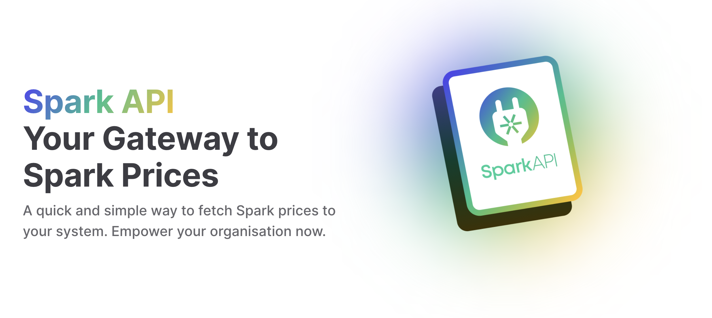

# Spark Commodities API Code Samples

Welcome to the Spark Commodities API Code Samples repository! 🚀 

By signing up to the 
[Spark Commodities platform](https://app.sparkcommodities.com) and 
[creating your client credentials](https://app.sparkcommodities.com/data-integrations/api#api-manage), 
subject to the your organisation's subscription status, you’ll be able to utilise 
Spark’s API. The API allows for a large amount of Spark data shown on the platform to be 
fetched and stored in your coding environment. This enables functionalities such as:

- Accessing both spot prices and Spark’s extensive database of historical data,
  allowing you to dig deeper into market trends.
- Automating Spark data feeds directly into your existing analysis scripts
- Recreating charts and tables seen on the platform
- Extending functionality beyond the platform, and producing your own complex analysis 
  products and chart types

## Available Examples

* [Python3 Examples](python3)
* [Python3 Jupyter Notebooks Examples](jupyter_notebooks)
* [Java8 Examples](java8)

## API documentation

The full API documentation is available [here](https://api.sparkcommodities.com/)

---

© 2024 Spark Commodities Pte Ltd. All rights reserved
